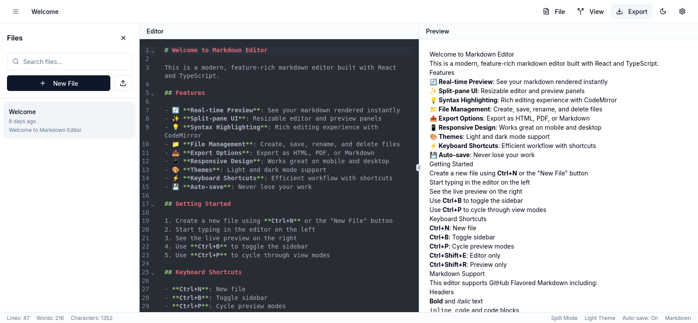

# Instant Markdown Canvas

A modern, real-time markdown editor with live preview functionality built with React, TypeScript, and Shadcn UI components.



## 🚀 Features

- **Real-time Preview**: See your markdown rendered instantly as you type
- **Split-pane UI**: Resizable editor and preview panels
- **Syntax Highlighting**: Rich editing experience with CodeMirror
- **File Management**: Create, save, rename, and delete files
- **Export Options**: Export as HTML, PDF, or Markdown
- **Responsive Design**: Works great on mobile and desktop
- **Themes**: Light and dark mode support
- **Keyboard Shortcuts**: Efficient workflow with shortcuts
- **Auto-save**: Never lose your work

## 🛠️ Tech Stack

- **Frontend**: React 18 with TypeScript
- **Styling**: Tailwind CSS with Shadcn UI components
- **State Management**: Zustand
- **Routing**: React Router DOM
- **Markdown Processing**: Marked.js
- **Security**: DOMPurify for sanitizing HTML output
- **Build Tool**: Vite

## 📋 Prerequisites

- Node.js (v16 or higher)
- npm or yarn or bun

## 🔧 Installation

1. Clone the repository:

   ```bash
   git clone https://github.com/yosephdev/markdown-editor
   cd markdown-editor
   ```

2. Install dependencies:

   ```bash
   npm install
   # or
   yarn install
   # or
   bun install
   ```

3. Start the development server:

   ```bash
   npm run dev
   # or
   yarn dev
   # or
   bun dev
   ```

4. Open your browser and navigate to `http://localhost:5173`

## 🖥️ Usage

1. **Creating a new document**: Use **Ctrl+N** or the "New File" button
2. **Editing**: Type your markdown in the editor panel
3. **Preview**: See the live preview in the preview panel
4. **Toggling Sidebar**: Use **Ctrl+B** or the menu icon to show/hide the sidebar
5. **Cycling View Modes**: Use **Ctrl+P** to switch between split, editor-only, and preview-only modes
6. **Saving**: Your work is **auto-saved**
7. **Exporting**: Use the export option in the toolbar to export as HTML, PDF, or Markdown
8. **File Management**: Access, rename, and delete files from the sidebar

## 📝 Markdown Support

Instant Markdown Canvas supports standard markdown syntax including:

- Headers (# H1, ## H2, etc.)
- Emphasis (*italic*, **bold**)
- Lists (ordered and unordered)
- Links and images
- Code blocks with syntax highlighting
- Blockquotes
- Horizontal rules
- Task lists
- Tables

## ⚡ Keyboard Shortcuts

- **Ctrl+N**: Create new file
- **Ctrl+B**: Toggle sidebar
- **Ctrl+P**: Cycle through view modes (Split, Editor Only, Preview Only)
- **Ctrl+Shift+E**: Switch to Editor Only mode
- **Ctrl+Shift+R**: Switch to Preview Only mode

## 🔍 Project Structure

```
instant-markdown-canvas/
├── public/               # Static assets
├── src/
│   ├── components/       # React components
│   │   ├── editor/       # Editor-specific components
│   │   ├── layout/       # Layout components (Toolbar, Sidebar, StatusBar)
│   │   ├── modals/       # Modal components
│   │   └── ui/           # Shadcn UI components
│   ├── contexts/         # React Contexts
│   ├── hooks/            # Custom React hooks
│   ├── lib/              # Utility functions
│   ├── pages/            # Page components
│   ├── store/            # Zustand store
│   ├── types/            # TypeScript type definitions
│   ├── App.tsx           # Main application component
│   └── main.tsx          # Entry point
├── package.json          # Dependencies and scripts
└── vite.config.ts        # Vite configuration
```

## 🧪 Running Tests

```bash
npm run test
# or
yarn test
# or
bun test
```

## 🚢 Deployment

1. Build the production version:

   ```bash
   npm run build
   # or
   yarn build
   # or
   bun run build
   ```

2. The build output will be in the `dist` directory, which can be deployed to any static hosting service like Netlify, Vercel, GitHub Pages, or AWS S3.

## 🤝 Contributing

Contributions are welcome! Please feel free to submit a Pull Request.

1. Fork the repository
2. Create your feature branch (`git checkout -b feature/amazing-feature`)
3. Commit your changes (`git commit -m 'Add some amazing feature'`)
4. Push to the branch (`git push origin feature/amazing-feature`)
5. Open a Pull Request

## 📄 License

This project is licensed under the MIT License - see the [LICENSE](LICENSE) file for details.

## 👏 Acknowledgments

- [React](https://reactjs.org/)
- [TypeScript](https://www.typescriptlang.org/)
- [Vite](https://vitejs.dev/)
- [Shadcn UI](https://ui.shadcn.com/)
- [Tailwind CSS](https://tailwindcss.com/)
- [Marked.js](https://marked.js.org/)
- [DOMPurify](https://github.com/cure53/DOMPurify)

## 📧 Contact

Yoseph Berhane - [contact@yoseph.dev](mailto:your.email@example.com)

Project Link: [https://github.com/yosephdev/markdown-editor](https://github.com/yosephdev/markdown-editor)
